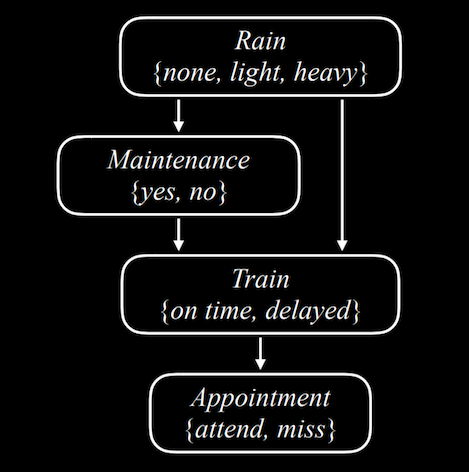
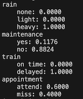
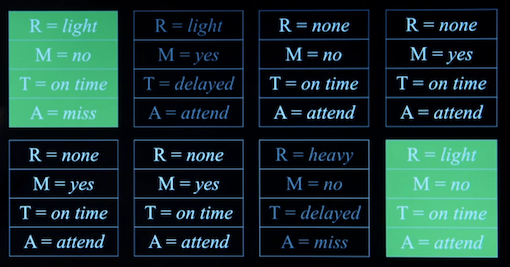
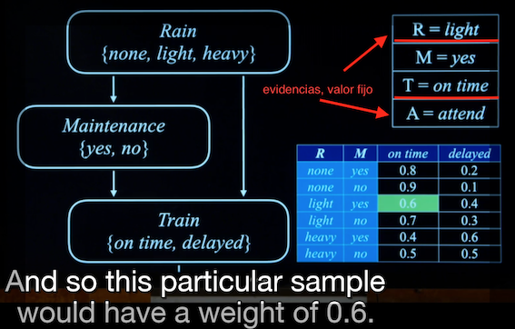
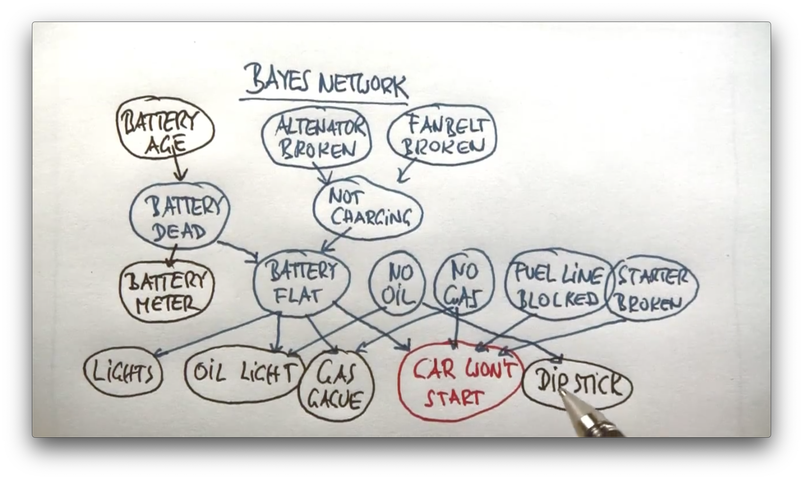

RED DE BAYES
============

Código del curso [CS50’s Introduction to Artificial Intelligence with Python](https://cs50.harvard.edu/ai/2024/), _lecture 2 "uncertainty"_, refactorizado a la nueva api de pomegranate v1.0.4 por [jmschrei](https://github.com/jmschrei/pomegranate/issues/1062)


## Instalación

Es necesario el uso del paquete [Pomegranate](https://pomegranate.readthedocs.io/en/stable/index.html):

> Pomegranate is a python package which implements fast, efficient, and extremely flexible probabilistic models ranging from probability distributions to Bayesian networks to mixtures of hidden Markov models.

`python -m venv venv`

`source venv/bin/activate`

Instalar la versión estricta de pomegranate `v1.0.4`:

`pip install -r requirements.txt`

o

`pip install pomegranate`

## Uso

### Red de Bayes

El código codifica la siguiente red de Bayes, en el módulo `model.py`:



Rain es el nodo raíz de la red. Rain es una variable aleatoria que toma los valores en el dominio atómico `{none, light, heavy}`. Su distribución de probabilidad es:

| none  | light | heavy |
| :---: | :---: | :---: |
|  0.7  |  0.2	|  0.1  |

Maintenance indica si se realiza mantenimiento en la red de transporte, tomando los valores atómicos `{yes, no}`. Rain es el nodo padre de Maintenance, lo que significa que su distribución de probabilidad se ve afectada por por Rain. 

| R     | yes | no  |
| :----:| :-: |:---:|
| none  | 0.4 | 0.6 |
| light | 0.2 | 0.8 |
| heavy | 0.1 | 0.9 |

Train es la variable que codifica si el tren llega `{on time, delayed}`. Maintenance y Rain son padres de Train, que implica que su distribución de probabilidad está condicionada por la de sus nodos padre:

 $$ P(X | Padres(X)) $$

| R     | M   | on time | delayed |
|:-----:|:---:|:-------:|:-------:|
| none  | yes | 0.8     | 0.2     |
| none  | no  | 0.9     | 0.1     |
| light | yes | 0.6     | 0.4     |
| light | no  | 0.7     | 0.3     |
| heavy | yes | 0.4     | 0.6     |
| heavy | no  | 0.5     | 0.5     |


Appointment toma los valores `{attend, miss}`. Es el único nodo padre de Train, indicando que lo que en última instancia afecta a llegar a tiempo a la cita es que el tren llegue puntual o no. Si el tren llega puntual, que llueva de manera torrencial o sea orballo no tiene efecto en llegar a tiempo a la cita.

| T        | attend | miss |
| :-------:|:------:|:----:|
| on time  | 0.9    | 0.1  |
| delayed  | 0.6    | 0.4  |

### Probabilidad conjunta

Calculamos la probabilidad de un determinado evento dada una observación, una observación de todas las variables, por lo que hablamos de **probabilidad conjunta** o _joint probabililty_.

¿Cual es la probabilidad de que no llueva, no se realice mantenimiento, el tren llegue puntual y asistamos a la cita?

$$ P(light)P(no | light)P(on time | light, no)P(attend | on time) $$

 $$ P(light, no, on time, attend) $$


```python
$ python likelihood.py

tensor([0.3402])
```

### Inferencia por enumeración

¿Cuáles son las distribuciones de probabilidades para todas las variables dada una evidencia, una observación?

Dada una observación o evidencia $e$, aplicamos la **inferencia por enumeración** iterando sobre las probabilidades de las variables ocultas $y$ :

 $$ P(X|e) = \frac{P(X,e)}{P(e)} = \alpha P(X,e) = \alpha \sum_{y} {P(X,e,y)} $$

Con la observación de que el tren se ha retrasado, calculamos las **distribuciones de probabilidad** de las variables Rain, Maintenance y Appointment.

```python
$ python inference.py

rain
    none: 0.4583
    light: 0.3069
    heavy: 0.2348
maintenance
    yes: 0.3567
    no: 0.6433
train
    on time: 0.0000
    delayed: 1.0000
appointment
    attend: 0.6000
    miss: 0.4000
```

`likelihood.py` y `inference.py` son dependientes del módulo `model.py`.

En el código de estos tres ficheros encontrarás la explicación de cómo se codifica la red de bayes en pomegranate.

#### Ejercicio inferencia

Intenta calcular la probabilidad de llegar a tiempo o tarde a la cita, dependiendo de que el tren llegue tarde (_delayed_) y se produzca lluvia fuerte (_heavy_).

¿Ha cambiado la probabilidad de atender a la cita respecto al ejemplo anterior? ¿Por qué?

Chequea la configuración en el fichero `inference_ejercicio.py`.



### Rejection sampling

Como la inferencia por enumeración puede resultar computacionalmente ineficiente, es posible implementar el cálculo de la distribución de la probabilidad de la variable _appoinment_ (perder la cita, _miss_ o _attend_) en función de la probabilidad condicionada a que el tren llegue tarde (_delayed_), mediante el método _rejection sampling_. 

$$ P(Appoinment| Train = delayed) = \frac{P(Appoinment, Train = delayed)}{P(Train = delayed)} = \\ = \alpha P(Appoinment, Train = delayed) = \\ = \alpha \sum_{y \in Rain, Maintenance } {P(Appoinment, Train = delayed,y)} $$

Se trata de tomar N muestras sobre la red de bayes y seleccionar aquellas que verifiquen que:

```python
[?, ?, 1, 0]  [rain, maintenance, "delayed", "attend"]
[?, ?, 1, 1]  [rain, maintenance, "delayed", "miss"]
```

Si el caso fuese Rain = light y Train = ontime, el muestreo correspondería a la figura:



_Rejection samplig_ un cálculo aproximado de la probabilidad, que variará en función del número de muestras sampleadas que categoricemos como _attend_ o _miss_, por lo que la ejecución de `sample.py` arroja ligeras variaciones en el conteo de cada muestra.

Consulta el módulo `sammple.py`.

```python
$ python sample.py

Counter({'attend': 1224, 'miss': 884})
# y en sucesivos muestreos
Counter({'attend': 1216, 'miss': 821})
Counter({'attend': 1231, 'miss': 843})
Counter({'attend': 1340, 'miss': 826})
```

¿Cuál es la distribución de probabilidad normalizada? Para el último muestreo:

$$ P(Appoinment| Train = delayed) = < 0.616, 0.384>  $$

### Likelihood weighting

En el ejemplo anterior se observa que en 10K muestras se rechazan aproximadamente el 80% de las muestras sampleadas. Esto es otro motivo de ineficiencia computacional.

Podemos realizar el muestreo esta ve fijando el valor de las variables observadas, las evidencias, y no muestrelarlas. Calcularemos las probabilidades condicionales del resto de variables usando la red de Bayes o de creencia, y multiplicaremos cada muestra por su probabilidad.



## Recursos sobre probabilidad y redes de Bayes

Mi compañero [@alejandro](https://github.com/avidaldo) del curso de especialización en IA y Big Data del IES de Teis en la modalidad a distancia ha preparado estos recursos en castellano: [Matemáticas para Machine Learning](https://github.com/avidaldo/mates_ml).

Recordad que esta práctica intenta cubrir los contenidos de los capítulos 12 _Quantifying Uncertainty_ y 13 _Probabilistic Reasoning_ del libro _IA, un enfoque moderno_ de Russell & Norvig. Allí encontraréis explicacos en profundidad los conceptos más importantes sobre teoría de probabilidad que explicamos de manera práctica en clase sobre estos dos supuestos prácticos:

* "Trata de arrancarlo" o "Un sistema de diagnóstico de averías inteligente como asistente para mecánicos", un ejemplo explicado por Sebastian Thrun en su famoso y pionero MOCC sobre IA: 



* Probabilidades sobre dos dados:


### Principios

Los principios más importantes para comprender la teoría de probabilidades son:

* La letra griega $\Omega$ (omega mayúscula) representa el **espacio de muestras**, y $\omega$ (omega minúscula) se refiere a los elementos de ese espacio, es decir, a los **posibles mundos**.

* Los posibles mundos son mútuamente **exclusivos** y **exhaustivos**: dos posibles mundos no pueden existir a la vez, y uno de los posibles mundos debe producirse.

* Un modelo de probabilidad completamente especificado asocia una probabilidad numérica $P(ω)$ con cada posible mundo.

* El axioma básico de la teoría de la probabilidad enuncia que todo mundo posible tiene una probabilidad entre 0 y 1, y que la probabilidad total del conjunto de posibles mundos es es 1:

$$ 0 \leq P(ω) \leq 1 \quad \forall \omega $$

$$ \sum_{w\in\Omega} P(ω)=1 $$

#### Ejemplo

Jugamos con tres cartas, una reina $Q$, un rey $K$ y un comodín (o _jack_) $J$. Todas las cartas están boca abajo, elegimos una al azar y le damos la vuelta. ¿Cuál es el conjunto de resultados? 
Los posibles resultados son $\Omega = \{ Q, K, J\}$

### Negación

$$ P(A) = 1 - P(\neg A) $$

si $A$ y $A^c$ son disjuntos.

$$ P(A^c \cup A) = P(A^c) + P(A) = P(\Omega) = 1 $$

### Independencia

Dos eventos $A$ y $B$ son independientes si y sólo si:

$$ P(A \cap B) = P(A)P(B) $$

#### Ejemplo

El espacio de muestras de un dado de seis caras es $\Omega = \{ 1, 2, 3, 4, 5, 6 \}$

En un dado sin trucar, cada muestra tiene la misma probabilidad $P(\omega) = 1 /6$. 
Si lanzamos dos dados, el resultado de cada dado es independiente del otro. ¿Cuál es la probabilidad de obtener dos treses?

$$ P(tres \cap tres) = P(tres)P(tres) = (1/6) \times (1/6) = 1/36 $$

Este ejemplo también sirve para demostrar que dos sucesos son independientes. Dos sucesos son independientes si $P(A \cap B) = P(A)P(B)$.

La probabilidad de obtener un tres en uno de los dados es $1/6$, igual que la probabilidad de obtener $1/6$ en el otro dado. Por tanto: $P(A)P(B)= (1/6) \times (1/6) = 1/36$

La probabilidad de obtener dos treses se puede calcular dividiendo el número de las muestras que satisfacen esa condición entre el número total de muestras:
$$ P(A \cap B) = \frac {Número \ de \  muestras \ en \ A \cap B}{Número \ total \ de \ muestras \ en \ \Omega } $$
El número total de muestras en $\Omega$ es $36$ (son las posibles combinaciones de los 6 valores de cada uno de los dos dados). El número de muestras con dos $treses$ es $1$. Por tanto $P(F) = 1/36$.
Se verifica, por tanto, que los sucesos son independientes porque  $P(A)P(B)= 1/36 = P(A \cap B)$.

### Marginalización

$$ P(A) = P(A,B) + P(A, \neg B) $$

también expresada para variables aleatorias como:

$$ P(X=x_i) = \sum_j(X=x_i, Y=y_j) $$

### Teorema de la Probabilidad Total

$$ P(A) = P(A|B) P(B) + P(A|\neg B)  P(\neg B) $$

$$ P(A) = \sum_i P(A|B_i) P(B_i)$$

### Inclusión - Exclusión

$$ P(A \vee B) = P(A) + P(B) - P(A \wedge B)$$
